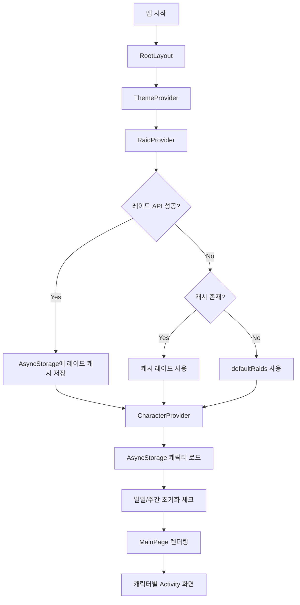

<div align="center">
  

  # 로아런 LoaRun

  **Lost Ark 캐릭터의 주간 레이드, 일일/주간 숙제, 골드 수익을 한눈에 관리하는 Expo React Native 앱**

  <br />

  
  
  
  
</div>

---

## 목차

- [프로젝트 소개](#프로젝트-소개)
- [개발 배경](#개발-배경)
- [주요 기능](#주요-기능)
- [기술 스택](#기술-스택)
- [핵심 구현 포인트](#핵심-구현-포인트)
- [프로젝트 구조](#프로젝트-구조)
- [데이터 흐름](#데이터-흐름)
- [실행 방법](#실행-방법)
- [테스트](#테스트)
- [환경 변수](#환경-변수)
- [포트폴리오 관점의 개선 경험](#포트폴리오-관점의-개선-경험)
- [라이선스](#라이선스)

---

## 프로젝트 소개

**로아런(LoaRun)** 은 Lost Ark 유저가 여러 캐릭터의 반복 콘텐츠 진행 상황과 골드 수익을 관리할 수 있도록 만든 모바일 앱입니다.

여러 캐릭터를 운영하는 게임 특성상 사용자는 다음 정보를 반복적으로 확인해야 합니다.

- 캐릭터별 주간 레이드 클리어 여부
- 레이드별 예상/획득 골드
- 일일 숙제 진행 여부
- 주간 숙제 진행 여부
- 원정대 단위 미션 진행 여부
- 기타 활동으로 얻은 골드 기록

로아런은 이 정보를 **캐릭터 단위 화면**과 **전체 요약 화면**으로 나누어 보여주며, AsyncStorage를 활용해 로컬에서 빠르게 상태를 저장하고 복원합니다.

---

## 개발 배경

Lost Ark는 캐릭터별로 관리해야 할 반복 콘텐츠가 많습니다. 특히 여러 캐릭터를 키우는 사용자는 매주 다음과 같은 불편함을 겪습니다.

1. 어떤 캐릭터가 어떤 레이드를 완료했는지 헷갈림
2. 캐릭터별 예상 골드와 실제 획득 골드를 따로 계산해야 함
3. 일일/주간 숙제 체크를 메모 앱이나 스프레드시트에 분산해서 관리함
4. 캐릭터 정보 갱신과 레이드 기본값 설정이 번거로움

이 프로젝트는 위 문제를 해결하기 위해 **게임 플레이 루틴에 최적화된 체크리스트 + 골드 계산 앱**을 목표로 개발했습니다.

---

## 주요 기능

### 캐릭터 관리

- Lost Ark 캐릭터 닉네임 기반 검색
- 캐릭터 클래스, 서버, 아이템 레벨 정보 저장
- 캐릭터 초상화 이미지 저장 및 표시
- 캐릭터 즐겨찾기/북마크 필터
- 추가순, 레벨순, 서버순 정렬

### 레이드 관리

- 아이템 레벨 기준 기본 추천 레이드 자동 설정
- 레이드별 난이도 및 관문 선택
- 관문별 클리어 체크
- 레이드 골드, 더보기 비용, 추가 골드 계산
- 주간 초기화 시 레이드 클리어 상태 자동 리셋

### 미션 체크리스트

- 캐릭터별 일일/주간 미션 관리
- 원정대 단위 미션 관리
- 미션별 골드 기록
- 매일 오전 6시 기준 일일 미션 초기화
- 수요일 오전 6시 기준 주간 미션 초기화

### 전체 요약

- 전체 캐릭터 예상 골드 합산
- 클리어한 레이드 골드 합산
- 일일/주간/원정대 미션 진행률 표시
- 지난주 수익 정보 표시

### 사용자 경험

- 라이트/다크 테마 지원
- SUIT 폰트 적용
- 커스텀 알림/프롬프트/모달 UI
- Expo Router 기반 화면 이동
- 로컬 저장소 기반 오프라인 친화적 상태 유지

---

## 기술 스택

| 영역 | 사용 기술 |
| --- | --- |
| App Framework | Expo 54, React Native 0.81 |
| Language | TypeScript |
| Routing | Expo Router |
| State Management | React Context API |
| Local Storage | `@react-native-async-storage/async-storage` |
| UI | React Native StyleSheet, Expo Vector Icons, React Native SVG |
| Font | Expo Font, SUIT |
| Test | Jest, jest-expo, Testing Library React Native |
| Build/Deploy | EAS 설정 포함 |

---

## 핵심 구현 포인트

### 1. Context 기반 도메인 분리

앱 전역 상태를 하나의 거대한 store에 모으지 않고, 도메인별 Context로 분리했습니다.

- `CharacterContext`: 캐릭터 CRUD, 정렬, 레이드/미션 상태, 일일/주간 초기화
- `RaidContext`: 레이드 API 호출, 캐시, 기본 레이드 fallback, 아이템 레벨별 레이드 필터링
- `AppSettingContext`: 정렬 기준, 검색 기록, 정보 표시 여부
- `ThemeContext`: 라이트/다크 테마 관리

### 2. API 실패에 대비한 fallback 구조

레이드 데이터는 API에서 가져오는 것을 우선하지만, 실패 상황을 고려해 다음 순서로 fallback합니다.

```text
API 레이드 데이터
  ↓ 실패 또는 빈 응답
AsyncStorage 캐시 데이터
  ↓ 캐시 없음
앱 내장 defaultRaids
```

이를 통해 네트워크가 불안정해도 앱이 기본 기능을 유지할 수 있도록 설계했습니다.

### 3. 아이템 레벨 기반 기본 레이드 추천

캐릭터를 추가할 때 캐릭터 아이템 레벨을 기준으로 입장 가능한 레이드를 계산하고, 상위 레이드를 기본 선택값으로 설정합니다.

```text
캐릭터 아이템 레벨
  → 입장 가능한 레이드 필터링
  → 노말/하드 중 적정 난이도 선택
  → 기본 선택 레이드 생성
```

### 4. 일일/주간 자동 초기화

Lost Ark의 콘텐츠 초기화 주기를 반영해 다음 기준으로 상태를 초기화합니다.

- 일일 초기화: 매일 오전 6시
- 주간 초기화: 매주 수요일 오전 6시

주간 초기화 시에는 레이드 클리어 상태와 일일/주간 미션 상태를 함께 초기화하고, 지난주 활동 기록을 보존합니다.

### 5. 로컬 저장소 기반 빠른 상태 복원

캐릭터 목록, 설정, 레이드 캐시, 테마 등 주요 상태는 AsyncStorage에 저장됩니다.

사용자가 앱을 다시 열었을 때 네트워크 요청을 기다리지 않고도 이전 상태를 빠르게 복원할 수 있습니다.

---

## 프로젝트 구조

```text
loarun/
├── app/                         # Expo Router 화면 및 모달
│   ├── _layout.tsx              # 전역 Provider, Stack 설정
│   ├── index.tsx                # 메인 페이지 진입점
│   ├── MainPage.tsx             # 캐릭터 목록/요약 화면
│   ├── AddCharacterScreen.tsx   # 캐릭터 검색 및 추가 화면
│   ├── CharacterActivityScreen.tsx
│   └── components/              # app 하위 화면 전용 컴포넌트
├── components/                  # 공용 UI 컴포넌트
├── context/                     # 전역 상태 Context
│   ├── CharacterContext.tsx
│   ├── RaidContext.tsx
│   ├── AppSettingContext.tsx
│   └── ThemeContext.tsx
├── utils/                       # API, 검증, 기본 데이터, 이미지 처리
│   ├── FetchLostArkAPI.tsx
│   ├── validateInput.ts
│   ├── defaultRaids.ts
│   ├── defaultMissions.ts
│   └── PortraitImage.tsx
├── hooks/                       # 커스텀 훅
├── theme/                       # 라이트/다크 색상 팔레트
├── assets/                      # 이미지, 아이콘, 폰트
└── __tests__/                   # Jest 테스트
```

---

## 데이터 흐름



---

## 실행 방법

### 1. 저장소 클론

```bash
git clone <repository-url>
cd loarun
```

### 2. 의존성 설치

```bash
npm ci
```

### 3. 개발 서버 실행

```bash
npm run start
```

### 4. 플랫폼별 실행

```bash
npm run android
npm run ios
npm run web
```

---

## 테스트

### 전체 테스트 실행

```bash
npm test
```

### watch 모드

```bash
npm run test:watch
```

### CI용 테스트

```bash
npm run test:ci
```

### 타입체크

```bash
npm run typecheck
```

---

## 환경 변수

앱은 Lost Ark 관련 데이터를 가져오기 위해 API 프록시 서버 주소를 사용할 수 있습니다.

```bash
EXPO_LOARUN_API_PROXY_URL=https://your-api-proxy.example.com
```

설정하지 않으면 앱 내부 기본값인 `https://loarun.j-jandy.com`을 사용합니다.

---

## 포트폴리오 관점의 개선 경험

이 프로젝트를 개발하면서 특히 다음 부분을 중점적으로 개선했습니다.

### 안정적인 비동기 UX

캐릭터 추가/갱신은 API 호출, 이미지 처리, 로컬 저장이 함께 일어나는 작업입니다. 비동기 작업이 끝나기 전에 성공 UI가 표시되지 않도록 `await`, `try/catch/finally`를 적용해 사용자에게 더 정확한 피드백을 제공하도록 개선했습니다.

### 테스트 가능한 구조

Context 의존성이 있는 hook 테스트에서 외부 Context와 Native 모듈을 mock 처리해 테스트가 앱 실행 환경에 덜 의존하도록 구성했습니다.

### 도메인 중심 상태 관리

캐릭터, 레이드, 설정, 테마를 Context 단위로 나누어 관심사를 분리했습니다. 덕분에 기능별 수정 범위가 명확하고, 화면 컴포넌트는 필요한 Context만 구독할 수 있습니다.

### 네트워크 실패 대응

API 데이터가 실패해도 캐시 또는 기본 데이터로 fallback하는 구조를 적용해, 모바일 환경에서 발생하기 쉬운 네트워크 불안정 상황에 대응했습니다.

---

## 앞으로 개선하고 싶은 점

- 실제 앱 화면 스크린샷을 README에 추가
- 레이드/미션 데이터 마이그레이션 로직 정리
- CI 파이프라인 구축
- 테스트 커버리지 확대
- API timeout 및 retry 정책 추가
- 오타가 포함된 legacy 필드명 마이그레이션
- 접근성 라벨과 터치 영역 개선

---

## 라이선스

오픈소스 라이선스 및 사용 라이브러리 정보는 [LICENSES.md](./LICENSES.md)를 참고하세요.
